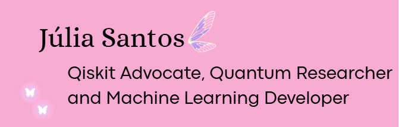

## Hiii, Welcome to my profile 👋!!

Computer Engineering student · Quantum Computing Researcher · Qiskit Advocate

### I'm currently learning...
<li> Deep Learning & Computer Vision
<li> Quantum Machine Learning
<li> AWS Cloud

### I work with...
<li> Machine Learning & Data Engineering
<li> MLOps, CI/CD and IaC
<li> Quantum Computing

## My skills...

